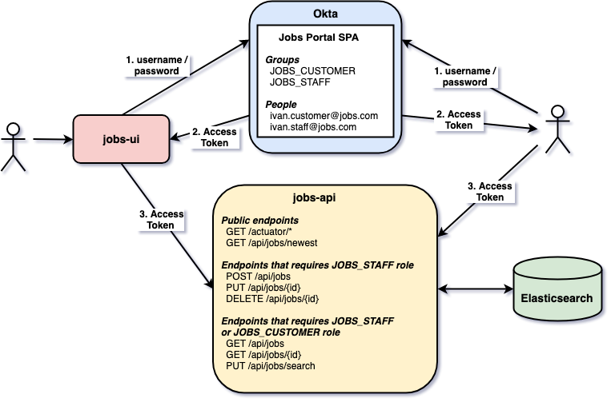

# `springboot-react-okta`

The goal of this project is to implement an application where a user can manage (create/read/update/delete) jobs. For it, we will create: a backend Restful API called `jobs-api` and a frontend user interface called `jobs-ui`. Furthermore, we will use [`Okta`](https://www.okta.com/) to secure the complete application.

## Project User Interface Preview


## Project diagram



## Applications

### jobs-api

[`Spring Boot`](https://docs.spring.io/spring-boot/docs/current/reference/htmlsingle/) Web Java application that exposes a REST API for managing jobs. It has some endpoints that are secured. `jobs-api` uses `Okta` to handle authentication and authorization. The table below shows the authorization role required to access the sensitive endpoints.

| Endpoint                | Role                        |
| ----------------------- | --------------------------- |
| `GET /actuator/*`       |                             |
| `GET /api/jobs/newest`  |                             |
| `POST /api/jobs`        | `JOBS_STAFF`                |
| `PUT /api/jobs/{id}`    | `JOBS_STAFF`                |
| `DELETE /api/jobs/{id}` | `JOBS_STAFF`                |
| `GET /api/jobs/{id}`    | `JOBS_STAFF, JOBS_CUSTOMER` |
| `PUT /api/jobs/search`  | `JOBS_STAFF, JOBS_CUSTOMER` |

### jobs-ui

[`ReactJS`](https://reactjs.org/) frontend application where customers can look for a job and staff members can handle jobs. In order to access it, a person must login. The authentication is handled by `Okta`.

## Configuring Okta

First of all, you must create a free account at https://developer.okta.com/signup/. Once you have it, log in and let's start the configuration.

### Add an OpenID Connect Client

- In Okta Developer Dashboard, click on `Applications` and then on `Add Application` button.

- Select `Single-Page App` and click on `Next` button.

- Enter the following values in the form

| Setting             | Value                                   |
| ------------------- | --------------------------------------- |
| App Name            | Jobs Portal SPA                         |
| Base URIs           | http://localhost:3000                   |
| Login redirect URIs | http://localhost:3000/implicit/callback |
|                     | http://localhost:8080/authenticate      |
| Grant Types Allowed | Implicit                                |

- After the application is created, there are some values that you will need during all project configuration and execution.

| Setting     | Example (fake)              | Where to Find                                                      |
| ----------- | --------------------------- | ------------------------------------------------------------------ |
| Org URL     | https://dev-123456.okta.com | On the home screen of the developer dashboard, in the upper right  |
| Okta Domain | dev-123456.okta.com         | It is the Org URL without `https://`                               |
| Client ID   | 0bcky2d71eXtSsscC123        | In the applications list or on the `General` tab of a specific app |

### Enabling groups

- In Okta Developer Dashboard, hover the mouse on `API` then click on `Authorization Servers` menu.

- An authorization server table will appear. Edit `default` authorization server by clicking on the pen-symbol button.

- Go to `Scopes` tab and click on `Add Scope`.

- Add the scope with name `groups`, simple description `Okta internal groups`, select `Include in public metadata option` and, finally, click on `Create`.

- Go to `Claims` tab.

- Let's add the first claim. So, click on `Add Claim` button and add the settings displayed on the table below. After that, click on `Save` button.

| Setting               | Value         | Extra info |
| --------------------- | ------------- | ---------- |
| Name                  | groups        |            |
| Include in token type | Access Token  |            |
| Value type            | Groups        |            |
| Filter                | Matches regex | .*         |
| Include in            | Any scope     |            |

- Now, let's add the second and last claim. For it, click again on `Add Claim` button and add the settings displayed on the table below. After that, click on `Save` button.

| Setting               | Value         | Extra info |
| --------------------- | ------------- | ---------- |
| Name                  | groups        |            |
| Include in token type | ID Token      |            |
| Value type            | Groups        |            |
| Filter                | Matches regex | .*         |
| Include in            | Any scope     |            |

> Note. The only difference from the first claim is in the "Include in token type". The second has `ID Token` and the former `Access Token`.

### Creating groups

- In Okta Developer Dashboard, hover the mouse on `Users` then click on `Groups` menu.

- Let's add the first group. So, click on `Add Group` button, enter name `JOBS_STAFF` and for group description set `Jobs Staff Group`. Then, click on `Add Group` button.

- Let's add the second group. For it, click again on `Add Group` button, enter name `JOBS_CUSTOMER` and for group description type `Jobs Customer Group`. Then, click on `Add Group` button.

### Adding people

- In Okta Developer Dashboard, hover the mouse on `Users` then click on `People` menu.

- Let's add the first person. He is a Jobs Portal staff member. So, click on `Add Person` button and enter the following values in the form

| Setting    | Value               |
| ---------- | ------------------- |
| First name | Ivan                |
| Last name  | Staff               |
| Username   | ivan.staff@jobs.com |
| Groups     | JOBS_STAFF          |
| Password   | Set by admin        |

Enter a password and DO NOT select the checkbox `User must change password on first login`

- Let's add the second person. He is a Jobs Portal customer. For it, click on `Add Person` button and enter the following values in the form

| Setting    | Value                  |
| ---------- | ---------------------- |
| First name | Ivan                   |
| Last name  | Customer               |
| Username   | ivan.customer@jobs.com |
| Groups     | JOBS_CUSTOMER          |
| Password   | Set by admin           |

Enter a password and DO NOT select the checkbox `User must change password on first login`

## Start environment

In a terminal and inside `springboot-react-okta` root folder run
```
docker-compose up -d
```

## Running applications

### jobs-api

In a terminal, export the following environment variables. Those values were obtained while configuring Okta. See [`Configuring Okta > Add an OpenID Connect Client`](https://github.com/ivangfr/springboot-react-okta#add-an-openid-connect-client) section.
```
export OKTA_DOMAIN=...
export OKTA_CLIENT_ID=...
```

Then, inside `springboot-react-okta/jobs-api` folder, run the [`Maven`](https://maven.apache.org/) command below to start `jobs-api`
```
./mvnw clean spring-boot:run
```

### jobs-ui

Open a new terminal, go to `springboot-react-okta/jobs-ui` folder.

Create a file called `.env.local` with the following content. Those values were obtained while configuring Okta. See [`Configuring Okta > Add an OpenID Connect Client`](https://github.com/ivangfr/springboot-react-okta#add-an-openid-connect-client) section.
```
REACT_APP_OKTA_ORG_URL=...
REACT_APP_OKTA_CLIENT_ID=...
```

Execute the command below if you are running `jobs-ui` for the first time
```
npm install
```

To start `jobs-api`, run the following [`npm`](https://www.npmjs.com/)
```
npm start
```

It will open `job-ui` in a browser automatically.

## Applications URLS

| Application | URL                                   |
| ----------- | ------------------------------------- |
| jobs-api    | http://localhost:8080/swagger-ui.html |
| jobs-ui     | http://localhost:3000                 |

## Using jobs-ui

- Open a browser and access the url: http://localhost:3000

- Click on `Login` in the navigation bar

- The Okta login page will appear. Enter the username & password of the person added at the step [`Configuring Okta > Adding people`](https://github.com/ivangfr/springboot-react-okta#adding-people) and click on `Sign In`.

- Done!

> Note. If you are using the person `ivan.customer@jobs.com`, you will not be able to create/update/delete a job because it doesn't have the required role for it.

## Getting Access Token

In order to use just the `jobs-api` endpoints, you must have an access token. Below are the steps to get it.

- In a terminal, export the following environment variables. They were obtained while configuring Okta. See [`Configuring Okta > Add an OpenID Connect Client`](https://github.com/ivangfr/springboot-react-okta#add-an-openid-connect-client) section.
```
export OKTA_DOMAIN=...
export OKTA_CLIENT_ID=...
```

- Get Okta Access Token Url
```
export OKTA_ACCESS_TOKEN_URL="https://${OKTA_DOMAIN}/oauth2/default/v1/authorize?\
client_id=${OKTA_CLIENT_ID}\
&redirect_uri=http://localhost:8080/authenticate\
&scope=openid\
&response_type=token\
&response_mode=form_post\
&state=state\
&nonce=6jtp65rt9jf"

echo $OKTA_ACCESS_TOKEN_URL
```

- Copy the Okta Access Token Url from the previous step and past it in a browser

- The Okta login page will appear. Enter the username & password of the person added at the step [`Configuring Okta > Adding people`](https://github.com/ivangfr/springboot-react-okta#adding-people) and click on `Sign In`

- It will redirect to `authenticate` endpoint of `jobs-api` and the `Access token` will be displayed.

## Calling jobs-api endpoints using curl

### GET api/jobs/newest

The `api/jobs/newest` endpoint is public, so we can access it without any problem.
```
curl -i http://localhost:8080/api/jobs/newest?number=2
```
Response
```
HTTP/1.1 200
[{"id":"uuulE2sBTYouQKNL1uoV", ...},{"id":"u-ulE2sBTYouQKNL1-qb", ...}]
```

### GET api/jobs without Access Token

Try to get the list of jobs without informing the access token.
```
curl -i http://localhost:8080/api/jobs
```
Response
```
HTTP/1.1 401
```

### GET api/jobs with Access Token

First, get the access token as explained in [`Getting Access Token`](https://github.com/ivangfr/springboot-react-okta#getting-access-token) section. Then, export the access token to an environment variable.
```
export ACCESS_TOKEN=...
```

Call the get the list of jobs informing the access token
```
curl -i http://localhost:8080/api/jobs -H "Authorization: Bearer $ACCESS_TOKEN"
```
Response
```
HTTP/1.1 200
{"content":[{"id":"uISqEWsBpDcNLtN2kZv3","title":"Expert Java Developer - Cloud","company":"Microsoft","logoUrl"...}
```

> Note. If you are using the person `ivan.customer@jobs.com`, you will not be able to create/update/delete a job because it doesn't have the required role for it.

## Using jobs-api with Swagger

- First, get the access token as explained in [`Getting Access Token`](https://github.com/ivangfr/springboot-react-okta#getting-access-token) section.

- Open `jobs-api` Swagger website, http://localhost:8080/swagger-ui.html

- Click on `Authorize` button. Paste the access token in the `Value` field prefixed by `Bearer`, like `Bearer <access-token>`. Then, click on `Authorize` and on `Close` to finalize.

- Done! You can now access the sensitive endpoints.

> Note. If you are using the person `ivan.customer@jobs.com`, you will not be able to create/update/delete a job because it doesn't have the required role for it.

## Shutdown

Go to `jobs-api` and `jobs-ui` terminals and press `ctrl-c`

Then, to stop and remove containers, networks and volumes
```
docker-compose down -v
```

## How to upgrade jobs-ui dependencies to latest version

In a terminal and inside `springboot-react-okta/movies-ui` folder, run the following commands
```
npm i -g npm-check-updates
ncu -u
npm install
```

## References

- https://www.npmjs.com/package/@okta/okta-react
- https://developer.okta.com/code/react/okta_react_sign-in_widget/
- https://developer.okta.com/blog/2019/03/06/simple-user-authentication-in-react
- https://dzone.com/articles/23-useful-elasticsearch-example-queries
