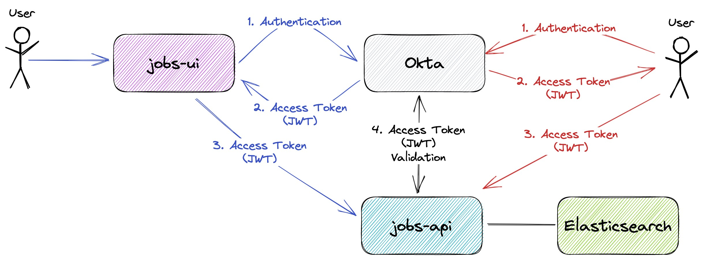
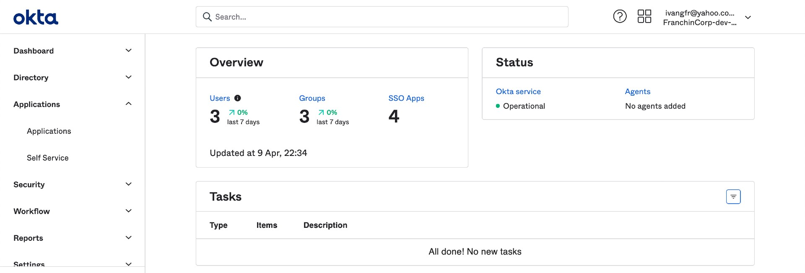

# okta-springboot-react

The goal of this project is to implement an application where a user can manage (create/read/update/delete) jobs. For it, we will create a backend Restful API called `jobs-api` and a frontend application called `jobs-ui`. Furthermore, we will use [`Okta`](https://www.okta.com/) to secure the complete application.

## Proof-of-Concepts & Articles

On [ivangfr.github.io](https://ivangfr.github.io), I have compiled my Proof-of-Concepts (PoCs) and articles. You can easily search for the technology you are interested in by using the filter. Who knows, perhaps I have already implemented a PoC or written an article about what you are looking for.

## Additional Readings

- \[**Medium**\] [**Implementing and Securing a Simple Spring Boot REST API with Okta**](https://medium.com/javarevisited/implementing-and-securing-a-simple-spring-boot-rest-api-with-okta-a5143696cd60)
- \[**Medium**\] [**Implementing and Securing a Simple Spring Boot UI (Thymeleaf + RBAC) with Okta**](https://medium.com/javarevisited/implementing-and-securing-a-simple-spring-boot-ui-thymeleaf-rbac-with-okta-9489cbbcec25)
- \[**Medium**\] [**Implementing and Securing a Spring Boot GraphQL API with Okta**](https://medium.com/javarevisited/implementing-and-securing-a-spring-boot-graphql-api-with-okta-78bc997359b4)
- \[**Medium**\] [**Building a Single Spring Boot App with Keycloak or Okta as IdP: Introduction**](https://medium.com/@ivangfr/building-a-single-spring-boot-app-with-keycloak-or-okta-as-idp-introduction-2814a4829aed)

## Project User Interface Preview


## Project diagram



## Applications

- ### jobs-api

  [`Spring Boot`](https://docs.spring.io/spring-boot/index.html) Web Java application that exposes a REST API for managing jobs. The job data are stored in [Elasticsearch](https://www.elastic.co/elasticsearch) It has some endpoints that are secured. `Okta` is used to handle authentication and authorization.
  
  The table below shows the endpoins, whether they are secured or not, and the authorization role required to access the secured ones.
 
  | Endpoint                | Secured | Role                        |
  | ----------------------- | ------- |-----------------------------|
  | `GET /actuator/*`       |      No |                             |
  | `POST /callback/token`  |      No |                             |
  | `GET /api/jobs/newest`  |      No |                             |
  | `POST /api/jobs`        |     Yes | `JOBS_STAFF`                |
  | `PUT /api/jobs/{id}`    |     Yes | `JOBS_STAFF`                |
  | `DELETE /api/jobs/{id}` |     Yes | `JOBS_STAFF`                |
  | `GET /api/jobs/{id}`    |     Yes | `JOBS_STAFF, JOBS_CUSTOMER` |
  | `PUT /api/jobs/search`  |     Yes | `JOBS_STAFF, JOBS_CUSTOMER` |

- ### jobs-ui

  [`React`](https://react.dev/) frontend application where customers can look for a job and staff members can handle jobs. In order to access it, a person must login. The authentication is handled by `Okta`.

## Prerequisites

- [`Java 21+`](https://www.oracle.com/java/technologies/downloads/#java21)
- [`npm`](https://docs.npmjs.com/downloading-and-installing-node-js-and-npm)
- [`Docker`](https://www.docker.com/)
- [`Okta` account](https://developer.okta.com/signup/)

## Configuring Okta

### Access Developer Edition Account

- If you do not have a Developer Edition Account, you can create one at https://developer.okta.com/signup/
- If you already have, access https://developer.okta.com/login/

### Access Okta Admin Dashboard

The picture below shows how `Okta Admin Dashboard` looks like



### Add Application

- In the `Okta Admin Dashboard` main menu on the left, click `Applications` menu and then `Applications` sub-menu
- On the next page, click `Create App Integration` button
- Select `OIDC - OpenID Connect` as _Sign on method_ and `Single-Page Application` as _Application type_. Click `Next` button
- Enter the following values in the form.
  - General Settings
    - App integration name: `Jobs Portal SPA`
    - Grant type: check `Authorization Code` and `Implicit (hybrid)`
    - Sign-in redirect URIs: `http://localhost:3000/implicit/callback` and `http://localhost:8080/callback/token`
    - Sign-out redirect URIs: `http://localhost:3000`
  - Assignments
    - Controlled access: `Skip group assignment for now`
- Click `Save` button
- On the next screen, the `Client ID` of `Jobs Portal SPA` is displayed. The `Okta Domain` can be obtained by clicking the button-menu present on the up-right corner of the screen.

### Create groups

- In the `Okta Admin Dashboard` main menu on the left, click `Directory` menu and then `Groups` sub-menu
- Add Staff Group
  - Click `Add Group` button
  - Enter `JOBS_STAFF` for the _Name_ text-field
  - Click `Save` button
- Add Customer Group
  - Click `Add Group` button
  - Enter `JOBS_CUSTOMER` for the _Name_ text-field
  - Click `Save` button

### Add people

- In the `Okta Admin Dashboard` main menu on the left, click `Directory` menu and then `People` sub-menu
- Click `Add person` button
- Enter the following information for the Staff person
  - First name: `Mario`
  - Last name: `Bros`
  - Username: `mario.bros@test.com`
  - Primary email: `mario.bros@test.com`
  - Groups: `JOBS_STAFF` (the group will popup; select it to add it)
  - Password: `Set by admin`
  - Set a strong password in the text-field that will appear
  - `Uncheck` the check-box that says _"User must change password on first login"_
  - Click `Save and Add Another` button
- Enter the following information for the Customer person
  - First name: `Luigi`
  - Last name: `Bros`
  - Username: `luigi.bros@test.com`
  - Primary email: `luigi.bros@test.com`
  - Groups: `JOBS_CUSTOMER` (the group will popup; select it to add it)
  - Password: `Set by admin`
  - Set a strong password in the text-field that will appear
  - Leave `Uncheck` the check-box that says _"User must change password on first login"_
  - Click `Save` button

### Assign Groups to Application

- In the `Okta Admin Dashboard` main menu on the left, click `Directory` menu and then `Groups` sub-menu
- Select `JOBS_STAFF`
- Click `Applications` tab
- Click `Assign Applications` button
- Click the `Assign` button related to `Jobs Portal SPA` and then click `Done`
- In the `Okta Admin Dashboard` main menu on the left, click `Groups` sub-menu again
- Select `JOBS_CUSTOMER`
- Click `Applications` tab
- Click `Assign Applications` button
- Click the `Assign` button related to `Jobs Portal SPA` and then click `Done`

### Add Claim

- In the `Okta Admin Dashboard` main menu on the left, click `Security` menu and then `API` sub-menu
- In `Authorization Servers` tab, select the `default`
- In `Claims` tab, click `Add Claim`
- Enter the following information for the claim
  - Name: `groups`
  - Include in token type:
    - Select `Access Token`
    - Keep `Always` in the right field
  - Value type: `Groups`
  - Filter:
    - Select `Matches regrex`
    - Set `.*` in the right field
  - Include in: `Any scope`
  - Click `Create` button

## Start Environment

- Open a terminal and inside `okta-springboot-react` root folder run
  ```
  docker compose up -d
  ```

- Wait for `elasticsearch` Docker container to be up and running. To check it, run
  ```
  docker compose ps
  ```

## Running applications

- **jobs-api**

  - In a terminal, navigate to `okta-springboot-react/jobs-api` folder

  - Export the following environment variables. Those values were obtained while [adding Application](#add-application)
    ```
    export OKTA_DOMAIN=...
    export OKTA_CLIENT_ID=...
    ```

  - Run the [`Maven`](https://maven.apache.org/) command below to start `jobs-api`
    ```
    ./mvnw clean spring-boot:run
    ```

- **jobs-ui**

  - Open a new terminal and navigate to `okta-springboot-react/jobs-ui` folder

  - Create a file called `.env.local` with the following content. Those values were obtained while [adding Application](#add-application)
    ```
    REACT_APP_OKTA_ORG_URL=https://<OKTA_DOMAIN>
    REACT_APP_OKTA_CLIENT_ID=<OKTA_CLIENT_ID>
    ```

  - If you are running `jobs-ui` for the first time, execute the [`npm`](https://www.npmjs.com/) command below
    ```
    npm install
    ```

  - To start `jobs-api` run
    ```
    npm start
    ```
    It will open `job-ui` in a browser automatically.

## Applications URLs

| Application | URL                                   |
| ----------- | ------------------------------------- |
| jobs-api    | http://localhost:8080/swagger-ui.html |
| jobs-ui     | http://localhost:3000                 |

## Using jobs-ui

- Open a browser and access http://localhost:3000

- Click `Login` in the navigation bar

- The Okta login page will appear. Enter the username & password of the person added at the step [`Configuring Okta > Add people`](#add-people) and click `Sign In`.

- Done!

> **Note**: If you are using the person `luigi.bros@test.com`, you will not be able to create/update/delete a job because it doesn't have the required role for it.

## Getting Access Token

In order to use just the `jobs-api` endpoints, you must have an `JWT` access token. Below are the steps to get it.

- In a terminal, create the following environment variables. Those values were obtained while [adding Application](#add-application)
  ```
  OKTA_DOMAIN=...
  OKTA_CLIENT_ID=...
  ```

- Get Okta Access Token Url
  ```
  OKTA_ACCESS_TOKEN_URL="https://${OKTA_DOMAIN}/oauth2/default/v1/authorize?\
  client_id=${OKTA_CLIENT_ID}\
  &redirect_uri=http://localhost:8080/callback/token\
  &scope=openid\
  &response_type=token\
  &response_mode=form_post\
  &state=state\
  &nonce=myNonceValue"

  echo $OKTA_ACCESS_TOKEN_URL
  ```

- Copy the Okta Access Token Url from the previous step and paste it in a browser

- The Okta login page will appear. Enter the username & password of the person added at the step [`Configuring Okta > Add people`](#add-people) and click `Sign In` button

- It will redirect to `/callback/token` endpoint of `jobs-api` and the `Access token` will be displayed, together with other information
  ```
  {
    "state": "state",
    "access_token": "eyJraWQiOiJyNFdY...",
    "token_type": "Bearer",
    "expires_in": "3600",
    "scope": "openid"
  }
  ```
  > **Note**: In [jwt.io](https://jwt.io), you can decode and verify the `JWT` access token

## Calling jobs-api endpoints using curl

- **`GET /api/jobs/newest`**

  The `api/jobs/newest` endpoint is public, so we can access it without any problem.
  ```
  curl -i http://localhost:8080/api/jobs/newest?number=2
  ```
  It should return
  ```
  HTTP/1.1 200
  [{"id":"uuulE2sBTYouQKNL1uoV", ...},{"id":"u-ulE2sBTYouQKNL1-qb", ...}]
  ```

- **`GET /api/jobs` without Access Token**

  Try to get the list of jobs without informing the access token.
  ```
  curl -i http://localhost:8080/api/jobs
  ```
  It should return
  ```
  HTTP/1.1 401
  ```

- **`GET /api/jobs` with Access Token**

  First, get the access token as explained in [`Getting Access Token`](#getting-access-token) section. Then, create an environment variable for the access token.
  ```
  ACCESS_TOKEN=...
  ```
  
  Call the get the list of jobs informing the access token
  ```
  curl -i http://localhost:8080/api/jobs -H "Authorization: Bearer $ACCESS_TOKEN"
  ```
  Response
  ```
  HTTP/1.1 200
  {"content":[{"id":"uISqEWsBpDcNLtN2kZv3","title":"Expert Java Developer - Cloud","company":"Microsoft","logoUrl"...}
  ```

  > **Note**: If you are using the person `luigi.bros@test.com`, you will not be able to create/update/delete a job because it doesn't have the required role for it.

## Using jobs-api with Swagger

- First, get the access token as explained in [`Getting Access Token`](#getting-access-token) section.

- Open `jobs-api` Swagger website http://localhost:8080/swagger-ui.html

- Click `Authorize` button. Paste the access token in the `Value` field. Then, click `Authorize` and `Close` to finalize.

- Done! You can now access the sensitive endpoints.

> **Note**: If you are using the person `luigi.bros@test.com`, you will not be able to create/update/delete a job because it doesn't have the required role for it.

## Shutdown

- Go to the terminals where `jobs-api` and `jobs-ui` are running and press `Ctrl+C`

- To stop and remove containers, network and volumes, run in a terminal the following command inside `okta-springboot-react` root folder
  ```
  docker compose down -v
  ```

## Cleanup

### Okta Configuration

#### Delete Person

- In the `Okta Admin Dashboard` main menu on the left, click `Directory` menu and then `People` sub-menu
- Click `Mario Bros` in the People list
- In `Mario Bros` profile, click `More Actions` multi-button and then `Deactivate`
- Confirm deactivation by clicking `Deactivate` button
- Still in `Mario Bros` profile, click `Delete` button
- Confirm deletion by clicking `Delete` button
- Click `Luigi Bros` in the People list
- In `Luigi Bros` profile, click `More Actions` multi-button and then `Deactivate`
- Confirm deactivation by clicking `Deactivate` button
- Still in `Luigi Bros` profile, click `Delete` button
- Confirm deletion by clicking `Delete` button

#### Delete Groups

- In the `Okta Admin Dashboard` main menu on the left, click `Directory` menu and then `Groups` sub-menu
- Select `JOBS_CUSTOMER`
- In `JOBS_CUSTOMER` profile, click `Actions` button and then `Delete` sub-button
- Confirm deletion by clicking `Delete Group` button
- Select `JOBS_STAFF`
- In `JOBS_STAFF` profile, click `Actions` button and then `Delete` sub-button
- Confirm deletion by clicking `Delete Group` button

#### Delete Application

- In the `Okta Admin Dashboard` main menu on the left, click `Applications` menu and then `Applications` sub-menu
- In Application list whose status is `ACTIVE`, click `Jobs Portal SPA`'s `gear` icon and then click `Deactivate`
- Confirm deactivation by clicking `Deactivate Application` button
- In Application list whose status is `INACTIVE`, click `Jobs Portal SPA`'s `gear` icon and then click `Delete`
- Confirm deletion by clicking `Delete Application` button

#### Delete Claim

- In the `Okta Admin Dashboard` main menu on the left, click `Security` menu and then `API` sub-menu
- In `Authorization Servers` tab, select the `default`
- In `Claims` tab, click the `x` icon related to the `groups` claim created
- Confirm deletion by clicking `OK` button

## How to upgrade jobs-ui dependencies to latest version

- In a terminal, make sure you are in `okta-springboot-react/jobs-ui` folder

- Run the following commands
  ```
  npm upgrade
  npm i -g npm-check-updates
  ncu -u
  npm install
  ```

## References

- https://www.npmjs.com/package/@okta/okta-react
- https://developer.okta.com/code/react/okta_react_sign-in_widget/
- https://developer.okta.com/blog/2019/03/06/simple-user-authentication-in-react
- https://dzone.com/articles/23-useful-elasticsearch-example-queries
